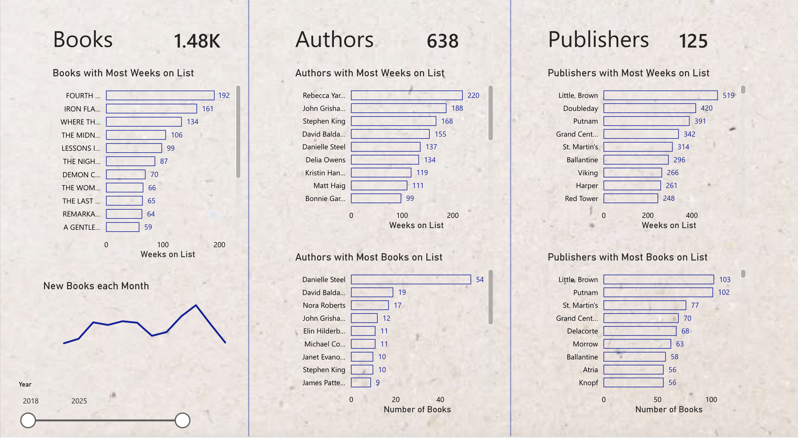

# NYT Bestseller ETL Pipeline (Azure + Power BI)

This project implements an end-to-end data engineering pipeline using the New York Times Bestseller API. Raw JSON data is extracted, normalized, then loaded into a cloud-based relational database, and finally visualized using Power BI. 

## Architecture

NYT Books API  
- Python ETL  
- Azure Blob Storage
- Azure SQL Database  
- Power BI (web)

## ETL Pipeline

### extract_json.py
- Pulls weekly NYT Bestseller data via API
- Saves raw JSON locally + uploads to Azure Blob Storage
- Handles API rate limiting and historical backfill

### transform_json.py
- Normalizes nested JSON into relational structure
- Produces:
  - `books.csv` (book-level attributes)
  - `appearances.csv` (weekly rankings)
- Stores cleaned outputs locally and in Azure Blob Storage

### load_to_sqlite.py
- Loads cleaned CSVs into Azure SQL Database
- Creates relational tables with primary/foreign keys
- Designed to support BI tools and analytical queries

## SQL
Exploratory SQL queries in `sql/azure_views.sql`, which investigate questions regarding publisher dominance, author longevity, book debut performance, seasonal trends. Exploratory and analytical SQL queries are written in Azure SQL (T-SQL) and saved as database views to support BI usage.

## Power BI Dashboard
The Power BI dashboard connects directly to Azure SQL and refreshes automatically when the pipeline is rerun.

